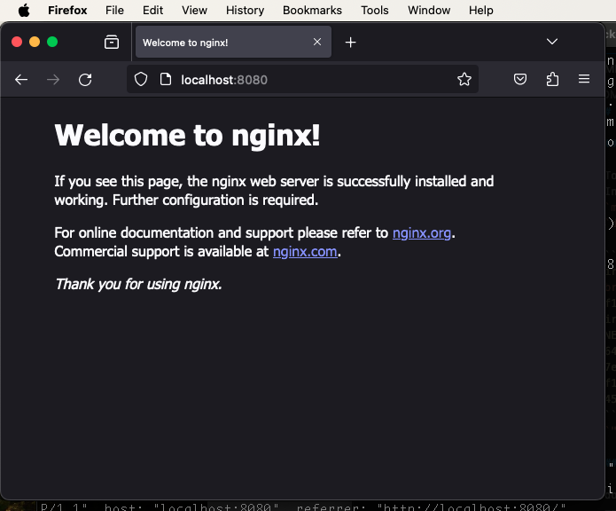
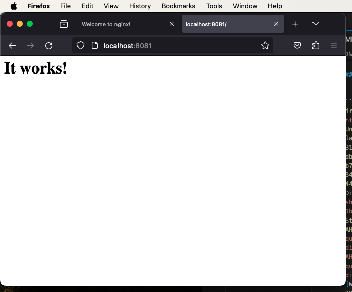
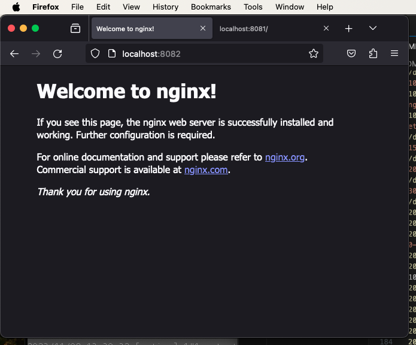

# Docker Networking

## Create Docker Network

To create a docker `network docker network create` command is used. In below log i have created a network using bridge driver named `my_network` and verified that it is created or not using command `docker network ls`

`docker network create --driver bridge my_network`

```bash
irehankhan@Rehans-Mac-mini ~ % docker network create --driver bridge my_network
f17611ad95faa9d6b66fb7ca66d22dbf79528c0ae93cf207614502a640904a06
irehankhan@Rehans-Mac-mini ~ % docker network ls
NETWORK ID     NAME         DRIVER    SCOPE
64fdf35b258e   bridge       bridge    local
7ea0e5e47815   host         host      local
f17611ad95fa   my_network   bridge    local
4567ff572487   none         null      local
```
`"f17611ad95fa   my_network   bridge    local"`

## Create Docker Container

## nginx Container

To Create a docker container using `nginx` image with name `nginx_container` and connect it to network named `my_network` i used below command and embed logs

`docker run -p 8080:80 --name nginx_container --network my_network nginx`

In above `run` command i used `-p` option to expose my container port to host as 8080 `--name` option to name it `nginx_container`, `--network` option to connect to my created network named `my_network` and the end i used `nginx` docker image

```bash
irehankhan@Rehans-Mac-mini ~ % docker run -p 8080:80 --name nginx_container --network my_network nginx
Unable to find image 'nginx:latest' locally
latest: Pulling from library/nginx
31ce7ceb6d44: Pull complete 
f1359798dfe4: Pull complete 
4de1e0313830: Pull complete 
7745719004b6: Pull complete 
0f17732d34d5: Pull complete 
0eb0ed12e64c: Pull complete 
5836f8c1cebc: Pull complete 
Digest: sha256:86e53c4c16a6a276b204b0fd3a8143d86547c967dc8258b3d47c3a21bb68d3c6
Status: Downloaded newer image for nginx:latest
/docker-entrypoint.sh: /docker-entrypoint.d/ is not empty, will attempt to perform configuration
/docker-entrypoint.sh: Looking for shell scripts in /docker-entrypoint.d/
/docker-entrypoint.sh: Launching /docker-entrypoint.d/10-listen-on-ipv6-by-default.sh
10-listen-on-ipv6-by-default.sh: info: Getting the checksum of /etc/nginx/conf.d/default.conf
10-listen-on-ipv6-by-default.sh: info: Enabled listen on IPv6 in /etc/nginx/conf.d/default.conf
/docker-entrypoint.sh: Sourcing /docker-entrypoint.d/15-local-resolvers.envsh
/docker-entrypoint.sh: Launching /docker-entrypoint.d/20-envsubst-on-templates.sh
/docker-entrypoint.sh: Launching /docker-entrypoint.d/30-tune-worker-processes.sh
/docker-entrypoint.sh: Configuration complete; ready for start up
2023/11/08 13:20:33 [notice] 1#1: using the "epoll" event method
2023/11/08 13:20:33 [notice] 1#1: nginx/1.25.3
2023/11/08 13:20:33 [notice] 1#1: built by gcc 12.2.0 (Debian 12.2.0-14) 
2023/11/08 13:20:33 [notice] 1#1: OS: Linux 6.4.16-linuxkit
2023/11/08 13:20:33 [notice] 1#1: getrlimit(RLIMIT_NOFILE): 1048576:1048576
2023/11/08 13:20:33 [notice] 1#1: start worker processes
2023/11/08 13:20:33 [notice] 1#1: start worker process 29
2023/11/08 13:20:33 [notice] 1#1: start worker process 30
2023/11/08 13:20:33 [notice] 1#1: start worker process 31
2023/11/08 13:20:33 [notice] 1#1: start worker process 32
2023/11/08 13:20:33 [notice] 1#1: start worker process 33
2023/11/08 13:20:33 [notice] 1#1: start worker process 34
2023/11/08 13:20:33 [notice] 1#1: start worker process 35
2023/11/08 13:20:33 [notice] 1#1: start worker process 36
192.168.65.1 - - [08/Nov/2023:13:20:52 +0000] "GET / HTTP/1.1" 200 615 "-" "Mozilla/5.0 (Macintosh; Intel Mac OS X 10.15; rv:109.0) Gecko/20100101 Firefox/119.0" "-"
2023/11/08 13:20:52 [error] 33#33: *1 open() "/usr/share/nginx/html/favicon.ico" failed (2: No such file or directory), client: 192.168.65.1, server: localhost, request: "GET /favicon.ico HTTP/1.1", host: "localhost:8080", referrer: "http://localhost:8080/"
192.168.65.1 - - [08/Nov/2023:13:20:52 +0000] "GET /favicon.ico HTTP/1.1" 404 153 "http://localhost:8080/" "Mozilla/5.0 (Macintosh; Intel Mac OS X 10.15; rv:109.0) Gecko/20100101 Firefox/119.0" "-"
```



## httpd Container
To Create a docker container using `httpd` image with name `httpd_container` and connect it to network named `my_network` i used below command and embed logs

`docker run -p 8081:80 --name httpd_container --network my_network httpd`

In above `run` command i used `-p` option to expose my container port to host as 8081 `--name` option to name it `httpd_container`, `--network` option to connect to my created network named `my_network` and the end i used `httpd` docker image

```bash
irehankhan@Rehans-Mac-mini ~ % docker run -p 8081:80 --name httpd_container --network my_network httpd
Unable to find image 'httpd:latest' locally
latest: Pulling from library/httpd
31ce7ceb6d44: Already exists 
db8fc7b4e131: Pull complete 
b7b6cd577ff4: Pull complete 
34532ee3d673: Pull complete 
44aebbdfc447: Pull complete 
Digest: sha256:4e24356b4b0aa7a961e7dfb9e1e5025ca3874c532fa5d999f13f8fc33c09d1b7
Status: Downloaded newer image for httpd:latest
AH00558: httpd: Could not reliably determine the server's fully qualified domain name, using 172.18.0.3. Set the 'ServerName' directive globally to suppress this message
AH00558: httpd: Could not reliably determine the server's fully qualified domain name, using 172.18.0.3. Set the 'ServerName' directive globally to suppress this message
[Wed Nov 08 13:28:21.283735 2023] [mpm_event:notice] [pid 1:tid 281473801498656] AH00489: Apache/2.4.58 (Unix) configured -- resuming normal operations
[Wed Nov 08 13:28:21.283819 2023] [core:notice] [pid 1:tid 281473801498656] AH00094: Command line: 'httpd -D FOREGROUND'
192.168.65.1 - - [08/Nov/2023:13:28:54 +0000] "GET / HTTP/1.1" 200 45
192.168.65.1 - - [08/Nov/2023:13:28:54 +0000] "GET /favicon.ico HTTP/1.1" 404 196
```



## Docker Network Inspect

After creating network named `my_network` and connecting containers `nginx_container` & `httpd_container` to this network i used below command to inspect `my_network` and shared the logs below. 

`docker network inspect my_network`

```bash
irehankhan@Rehans-Mac-mini ~ % docker network inspect my_network
[
    {
        "Name": "my_network",
        "Id": "f17611ad95faa9d6b66fb7ca66d22dbf79528c0ae93cf207614502a640904a06",
        "Created": "2023-11-08T11:53:48.813472336Z",
        "Scope": "local",
        "Driver": "bridge",
        "EnableIPv6": false,
        "IPAM": {
            "Driver": "default",
            "Options": {},
            "Config": [
                {
                    "Subnet": "172.18.0.0/16",
                    "Gateway": "172.18.0.1"
                }
            ]
        },
        "Internal": false,
        "Attachable": false,
        "Ingress": false,
        "ConfigFrom": {
            "Network": ""
        },
        "ConfigOnly": false,
        "Containers": {
            "8ae8f55db3c69d5853dedd454a5b24ea351320ba03c9b2c9cf2e18b0b8e63c67": {
                "Name": "httpd_container",
                "EndpointID": "5e53b0249cb7c9a317af8cd30bb28ea0e2630bb9b11681e8eb95148a8574a414",
                "MacAddress": "02:42:ac:12:00:03",
                "IPv4Address": "172.18.0.3/16",
                "IPv6Address": ""
            },
            "a8ebf2a653c75b2c91cbc587c32c42d34df50f9477fd9f539e6d00b52688f20d": {
                "Name": "nginx_container",
                "EndpointID": "c88a87bb8339c76efd59057ad97c07f9e7291a2782b166f219d6281422ad633b",
                "MacAddress": "02:42:ac:12:00:02",
                "IPv4Address": "172.18.0.2/16",
                "IPv6Address": ""
            }
        },
        "Options": {},
        "Labels": {}
    }
]
```
## Stop & Remove nginx Container
After that i have stopped and removed the container `a8e` `nginx_container` in below log

```bash
irehankhan@Rehans-Mac-mini ~ % docker ps
CONTAINER ID   IMAGE     COMMAND                  CREATED          STATUS          PORTS                  NAMES
8ae8f55db3c6   httpd     "httpd-foreground"       7 minutes ago    Up 7 minutes    0.0.0.0:8081->80/tcp   httpd_container
a8ebf2a653c7   nginx     "/docker-entrypoint.…"   15 minutes ago   Up 15 minutes   0.0.0.0:8080->80/tcp   nginx_container
irehankhan@Rehans-Mac-mini ~ % docker stop a8e
a8e
irehankhan@Rehans-Mac-mini ~ % docker rm a8e  
a8e
irehankhan@Rehans-Mac-mini ~ % docker ps -a
CONTAINER ID   IMAGE     COMMAND              CREATED         STATUS         PORTS                  NAMES
8ae8f55db3c6   httpd     "httpd-foreground"   8 minutes ago   Up 8 minutes   0.0.0.0:8081->80/tcp   httpd_container
irehankhan@Rehans-Mac-mini ~ % 
```
## nginx Container 2
Now again i have Created a docker container using `nginx` image with name `nginx_container_2` and connect it to network named `my_network` i used below command and embed logs

`docker run -p 8082:80 --name nginx_container_2 --network my_network nginx`

In above `run` command i used `-p` option to expose my container port to host as 8082 `--name` option to name it `nginx_container_2`, `--network` option to connect to my created network named `my_network` and the end i used `nginx` docker image

```bash
irehankhan@Rehans-Mac-mini ~ % docker run -p 8082:80 --name nginx_container_2 --network my_network nginx
/docker-entrypoint.sh: /docker-entrypoint.d/ is not empty, will attempt to perform configuration
/docker-entrypoint.sh: Looking for shell scripts in /docker-entrypoint.d/
/docker-entrypoint.sh: Launching /docker-entrypoint.d/10-listen-on-ipv6-by-default.sh
10-listen-on-ipv6-by-default.sh: info: Getting the checksum of /etc/nginx/conf.d/default.conf
10-listen-on-ipv6-by-default.sh: info: Enabled listen on IPv6 in /etc/nginx/conf.d/default.conf
/docker-entrypoint.sh: Sourcing /docker-entrypoint.d/15-local-resolvers.envsh
/docker-entrypoint.sh: Launching /docker-entrypoint.d/20-envsubst-on-templates.sh
/docker-entrypoint.sh: Launching /docker-entrypoint.d/30-tune-worker-processes.sh
/docker-entrypoint.sh: Configuration complete; ready for start up
2023/11/08 13:39:32 [notice] 1#1: using the "epoll" event method
2023/11/08 13:39:32 [notice] 1#1: nginx/1.25.3
2023/11/08 13:39:32 [notice] 1#1: built by gcc 12.2.0 (Debian 12.2.0-14) 
2023/11/08 13:39:32 [notice] 1#1: OS: Linux 6.4.16-linuxkit
2023/11/08 13:39:32 [notice] 1#1: getrlimit(RLIMIT_NOFILE): 1048576:1048576
2023/11/08 13:39:32 [notice] 1#1: start worker processes
2023/11/08 13:39:32 [notice] 1#1: start worker process 29
2023/11/08 13:39:32 [notice] 1#1: start worker process 30
2023/11/08 13:39:32 [notice] 1#1: start worker process 31
2023/11/08 13:39:32 [notice] 1#1: start worker process 32
2023/11/08 13:39:32 [notice] 1#1: start worker process 33
2023/11/08 13:39:32 [notice] 1#1: start worker process 34
2023/11/08 13:39:32 [notice] 1#1: start worker process 35
2023/11/08 13:39:32 [notice] 1#1: start worker process 36
192.168.65.1 - - [08/Nov/2023:13:40:38 +0000] "GET / HTTP/1.1" 200 615 "-" "Mozilla/5.0 (Macintosh; Intel Mac OS X 10.15; rv:109.0) Gecko/20100101 Firefox/119.0" "-"
2023/11/08 13:40:38 [error] 31#31: *1 open() "/usr/share/nginx/html/favicon.ico" failed (2: No such file or directory), client: 192.168.65.1, server: localhost, request: "GET /favicon.ico HTTP/1.1", host: "localhost:8082", referrer: "http://localhost:8082/"
192.168.65.1 - - [08/Nov/2023:13:40:38 +0000] "GET /favicon.ico HTTP/1.1" 404 153 "http://localhost:8082/" "Mozilla/5.0 (Macintosh; Intel Mac OS X 10.15; rv:109.0) Gecko/20100101 Firefox/119.0" "-"
```


## Docker Container ls
For checking running containers i used below command to display running containers information and found 2 containers running.

`docker container ls`

```bash
irehankhan@Rehans-Mac-mini ~ % docker container ls
CONTAINER ID   IMAGE     COMMAND                  CREATED          STATUS          PORTS                  NAMES
911840f433ef   nginx     "/docker-entrypoint.…"   2 minutes ago    Up 2 minutes    0.0.0.0:8082->80/tcp   nginx_container_2
8ae8f55db3c6   httpd     "httpd-foreground"       13 minutes ago   Up 13 minutes   0.0.0.0:8081->80/tcp   httpd_container
```
## Stop & Remove All Containers
After that i have stopped all running containers and removed them and verify removed containers mentioned in below logs using below commands

`docker container ls`

`docker stop 911 8ae`

`docker rm 911 8ae`

`docker ps -a`

```bash
irehankhan@Rehans-Mac-mini ~ % docker container ls
CONTAINER ID   IMAGE     COMMAND                  CREATED          STATUS          PORTS                  NAMES
911840f433ef   nginx     "/docker-entrypoint.…"   2 minutes ago    Up 2 minutes    0.0.0.0:8082->80/tcp   nginx_container_2
8ae8f55db3c6   httpd     "httpd-foreground"       13 minutes ago   Up 13 minutes   0.0.0.0:8081->80/tcp   httpd_container
irehankhan@Rehans-Mac-mini ~ % docker stop 911 8ae
911
8ae
irehankhan@Rehans-Mac-mini ~ % docker container ls
CONTAINER ID   IMAGE     COMMAND   CREATED   STATUS    PORTS     NAMES
irehankhan@Rehans-Mac-mini ~ % docker ps -a       
CONTAINER ID   IMAGE     COMMAND                  CREATED          STATUS                      PORTS     NAMES
911840f433ef   nginx     "/docker-entrypoint.…"   4 minutes ago    Exited (0) 17 seconds ago             nginx_container_2
8ae8f55db3c6   httpd     "httpd-foreground"       16 minutes ago   Exited (0) 16 seconds ago             httpd_container
irehankhan@Rehans-Mac-mini ~ % docker rm 911 8ae
911
8ae
irehankhan@Rehans-Mac-mini ~ % docker ps -a
CONTAINER ID   IMAGE     COMMAND   CREATED   STATUS    PORTS     NAMES
```
## Remove Docker Network
At last i have removed created docker network named `my_network` using `network docker network rm` command and verified. You can see below logs and commands

`docker network rm my_network`

`docker network ls`

```bash
irehankhan@Rehans-Mac-mini ~ % docker network ls
NETWORK ID     NAME         DRIVER    SCOPE
13555d6b203d   bridge       bridge    local
7ea0e5e47815   host         host      local
f17611ad95fa   my_network   bridge    local
4567ff572487   none         null      local
irehankhan@Rehans-Mac-mini ~ % docker network rm my_network
my_network
irehankhan@Rehans-Mac-mini ~ % docker network ls
NETWORK ID     NAME      DRIVER    SCOPE
13555d6b203d   bridge    bridge    local
7ea0e5e47815   host      host      local
4567ff572487   none      null      local
```


